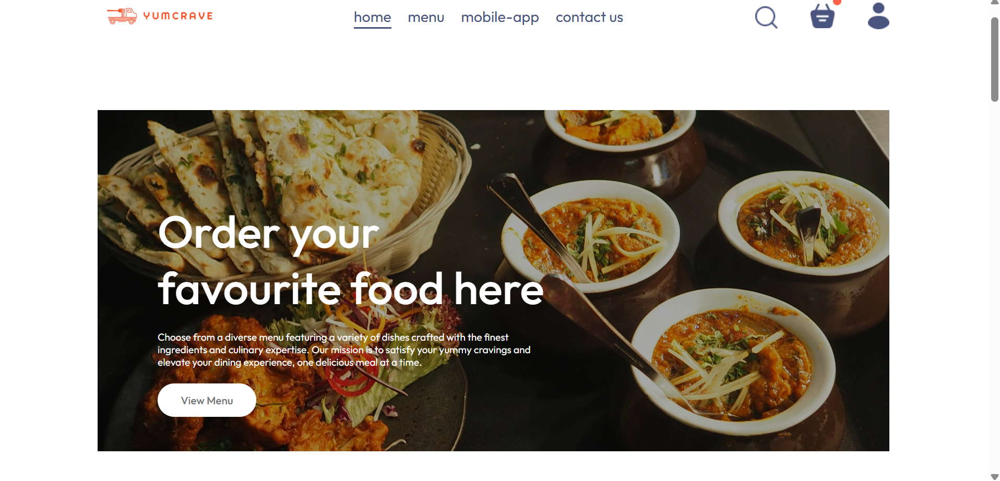
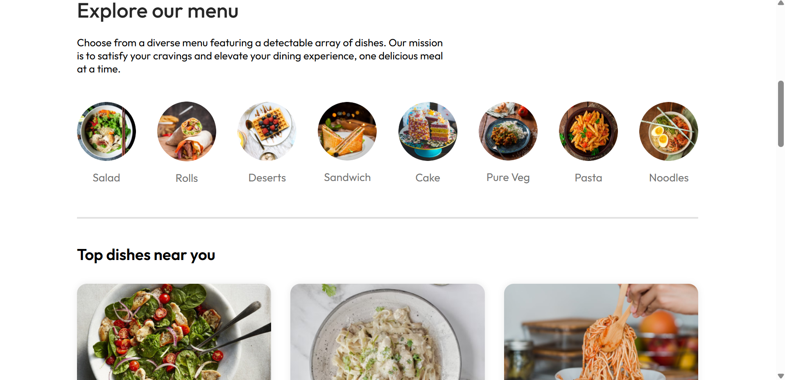
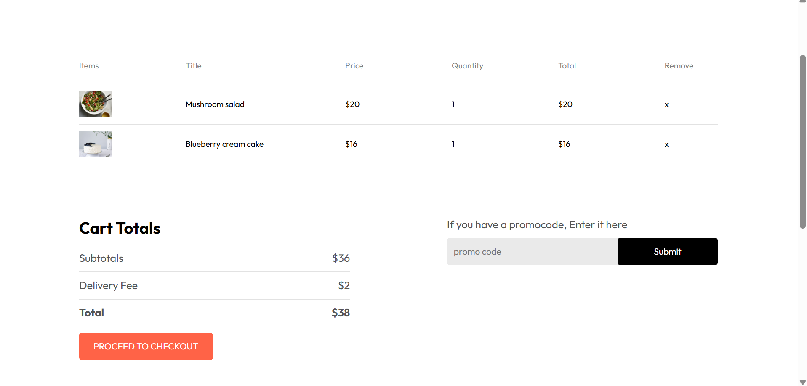
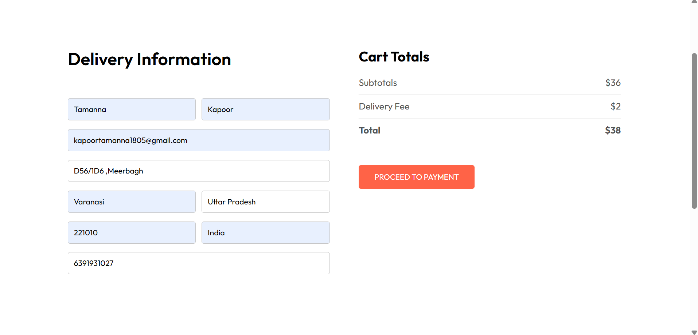
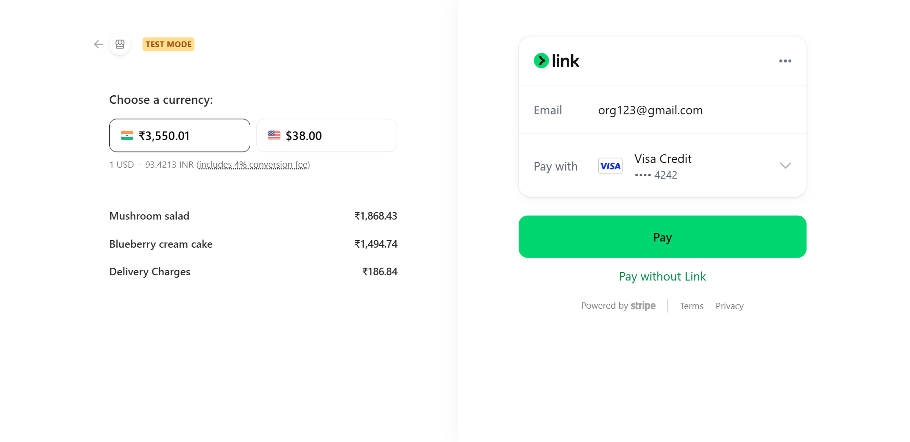
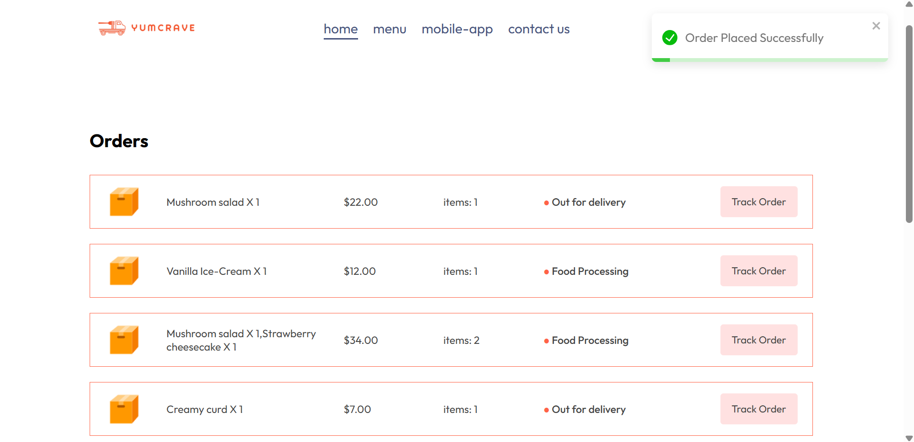
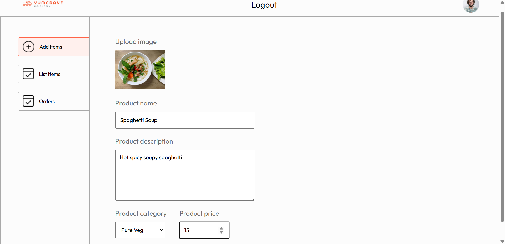
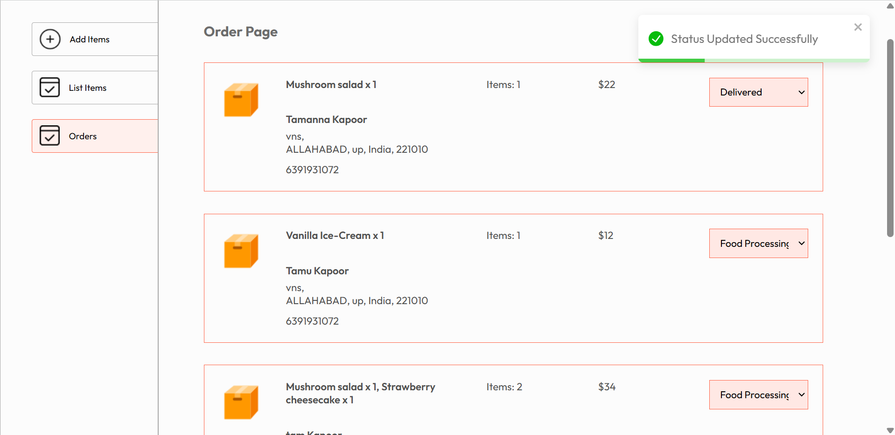

# 🍽️ YumCrave – Full Stack Food Ordering Website (MERN)

YumCrave is a **full-stack food delivery web application** built using the **MERN Stack**, featuring a **User Panel**, a **Dedicated Admin Panel**, secure authentication, cart persistence, and Stripe-based checkout.

The project is divided into **three main parts**:
- **Frontend (User Panel)**
- **Admin Panel**
- **Backend (API & Database)**

---

## 🌐 Demo

> (Add deployed links when available)

- **User Panel:** http://localhost:5173  
- **Admin Panel:** http://localhost:5174 
- **Backend API:** http://localhost:4000  

---

## ✨ Features

### 👤 User Panel
- User Authentication (Login / Signup)
- JWT-based Secure Authentication
- Password Hashing with **Bcrypt**
- Browse Food Items
- Add / Remove Items from Cart
- Persistent Cart (Database + LocalStorage)
- Place Orders with Delivery Details
- Stripe Checkout Integration
- View **My Orders**
- Track Order Status
- Toast Notifications for Feedback
- Responsive UI

---

### 🛠️ Admin Panel
- Separate Admin Application
- Admin Authentication
- Role-Based Authorization
- Add New Food Items
- Upload Food Images
- Remove Food Items
- View All Orders
- Update Order Status:
  - Food Processing
  - Out for Delivery
  - Delivered
- Only **paid orders** are shown in Admin Orders

---

### 💳 Payment System
- Stripe Checkout (Test Mode)
- Orders saved **only after successful payment**
- Failed or cancelled payments are automatically removed
- Secure backend verification
- Clean MongoDB records

---

## 🖼️ Screenshots

📸 Project Preview
🏠 Home Page
<p align="center">  </p>
🍔 Explore Menu
<p align="center">  </p>
🛒 Cart Page
<p align="center">  </p>
📍 Place Order
<p align="center">  </p>
💳 Stripe Checkout
<p align="center">  </p>
📦 My Orders (User Panel)
<p align="center">  </p>
🛠️ Admin Panel Preview

➕ Upload / Add Food Item
<p align="center">  </p>
📦 Orders Management (Admin)
<p align="center">  </p>

- Home Page  
- Login Popup  
- Cart Page  
- Checkout Page  
- My Orders  
- Admin Dashboard  
- Admin Orders Page  

---

## 🧱 Project Structure

YumCrave/
│
├── frontend/ # User Panel
│ ├── src/
│ │ ├── components/
│ │ ├── pages/
│ │ ├── context/
│ │ ├── assets/
│ │ └── App.jsx
│
├── admin/ # Admin Panel (Separate App)
│ ├── src/
│ │ ├── assets/
│ │ ├── components/
│ │ │ ├── Login/
│ │ │ ├── Navbar/
│ │ │ └── Sidebar/
│ │ ├── pages/
│ │ │ ├── Add/
│ │ │ ├── List/
│ │ │ └── Orders/
│ │ ├── context/
│ │ ├── App.jsx
│ │ └── index.css
│
├── backend/ # Backend API
│ ├── controllers/
│ ├── models/
│ ├── routes/
│ ├── middleware/
│ ├── uploads/
│ ├── server.js
│ └── .env
│
└── README.md


---

## 🛠️ Tech Stack

### Frontend & Admin
- React
- Vite
- React Router DOM
- Context API
- Axios
- React Toastify
- CSS

### Backend
- Node.js
- Express.js
- MongoDB
- Mongoose
- JWT Authentication
- Stripe
- Multer

---

## ⚙️ Run Locally

### 1️⃣ Clone Repository
```bash
git clone https://github.com/your-username/yumcrave.git
cd yumcrave

2️⃣ Install Dependencies

Frontend (User Panel)
cd frontend
npm install

Admin Panel
cd admin
npm install

Backend
cd backend
npm install

🔐 Environment Variables

Create a .env file inside the backend folder:

PORT=4000
MONGO_URL=YOUR_MONGODB_ATLAS_URL
JWT_SECRET=YOUR_JWT_SECRET
STRIPE_SECRET_KEY=YOUR_STRIPE_SECRET_KEY
SALT=10

▶️ Start Servers

Backend
cd backend
nodemon server.js

Frontend (User Panel)
cd frontend
npm run dev

Admin Panel
cd admin
npm run dev


🧪 Stripe Test Card

Use this for testing payments:

Card Number: 4242 4242 4242 4242
Expiry Date: Any future date
CVC: Any 3 digits
ZIP: Any


